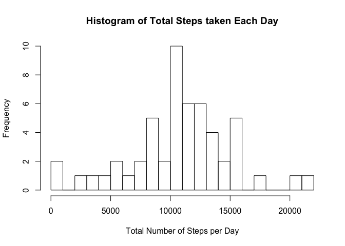
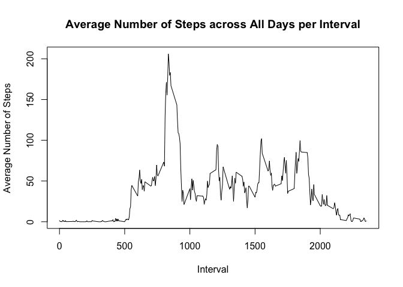
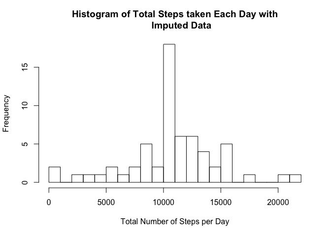
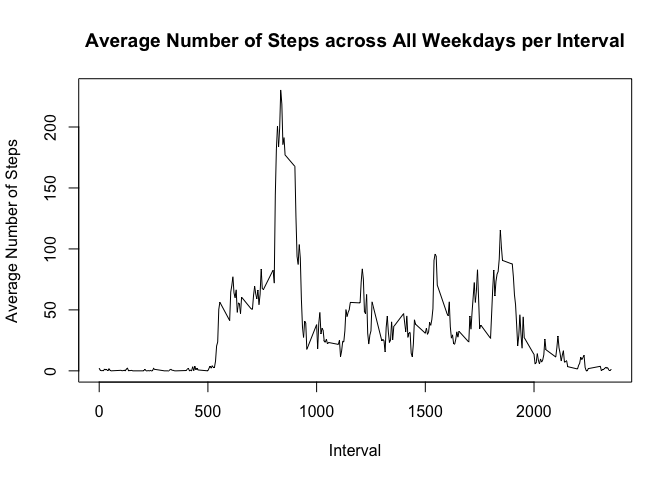
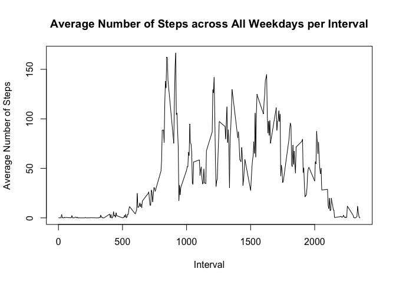

# Reproducible Research: Peer Assessment 1

## Loading and preprocessing the data


```r
# load the required packages
library("dplyr")
```

```
## 
## Attaching package: 'dplyr'
```

```
## The following objects are masked from 'package:stats':
## 
##     filter, lag
```

```
## The following objects are masked from 'package:base':
## 
##     intersect, setdiff, setequal, union
```

```r
# load the data
dat<-read.csv('activity.csv')
```

## What is mean total number of steps taken per day?

For this part of the assignment, you can ignore the missing values in the dataset.

    1. Make a histogram of the total number of steps taken each day


```r
# Filter out missing values.
dat_no_na<- dat %>% filter(!is.na(steps))

# For each day sum up the number of steps taken.
total_steps_table <- dat_no_na %>% group_by(date) %>% 
    summarise(total_steps=sum(steps))
total_steps <- total_steps_table$total_steps

# non-dplyr version
# dat_no_na<-dat[!is.na(dat$steps),]
# total_steps<- tapply(dat_no_na$steps, as.factor(dat_no_na$date), FUN=sum)

# Histogram of steps taken each day
hist(total_steps, main = "Histogram of Total Steps taken Each Day",
     xlab = "Total Number of Steps per Day", 
     breaks = 16)
```

<!-- -->

    2. Calculate, report the mean and median total number of steps taken per day


```r
# calculate the mean and median
mean <- mean(total_steps)
median <- median(total_steps)
```

    The mean total number of steps taken per day is 10766.
    The median total number of steps taken per day is 10765.
    
## What is the average daily activity pattern?

    1. Make a time series plot of the 5-minute interval and the average number 
    of steps taken, averaged across all days 
    

```r
# for each interval calculate the average (across all days) of the taken steps 
avg_steps_table <- dat_no_na %>% 
    group_by(interval) %>% 
    summarise(average_steps=mean(steps))

# plot the average number of steps per interval
plot(y=avg_steps_table$average_steps, x=avg_steps_table$interval, 
     type='l', xlab='Interval', 
     ylab='Average Number of Steps',
     main='Average Number of Steps across All Days per Interval')
```

<!-- -->

```r
# non-dplyr version:
# avg_steps_by_interval <- tapply(dat_no_na$steps, 
#                                 intervals <- as.factor(dat_no_na$interval),
#                                 FUN=mean)
# intervals <- levels(as.factor(dat_no_na$interval))
# plot(y=avg_steps_by_interval, x=intervals, type='l', xlab='Interval',
#      ylab='Average Number of Steps',
#      main='Average Number of Steps across All Days per Interval')
```
    
    2. Which 5-minute interval, on average across all the days in the dataset, 
    contains the maximum number of steps?
    

```r
# pick the interval where the average_steps column is maximal
maximum_interval <- avg_steps_table %>% 
    filter(average_steps==max(average_steps)) %>%
    select(interval)

# non-dplyr version
# maximum_interval <- intervals[which(avg_steps_by_interval== max(avg_steps_by_interval))]
```

    Intervall with the maximum average number of steps is 835.

## Imputing missing values

    1. Calculate and report the total number of missing values in the dataset.


```r
# sum up the NA occurances
missing_values_count <- sum((is.na(select(dat, steps))))
```

    The number of missing values is 2304.
    
    2. Devise a strategy for filling in all of the missing values in the dataset.
    The strategy does not need to be sophisticated. For example, you could use 
    the mean/median for that day, or the mean for that 5-minute interval, etc.
    
    The strategy we apply here is using the average number of steps for that 
    interval for a missing value.
    
    3. Create a new dataset that is equal to the original dataset but with the
    missing data filled in.
    

```r
# join the original data set with the avg_steps_table to add the average_steps 
# colum for every interval in the dataset
dat_with_avg_steps <- left_join(dat, avg_steps_table, by="interval")

# use our added column to replace missing values and then remove the added column 
filled_data <- dat_with_avg_steps %>%
    mutate(steps = ifelse(is.na(steps), average_steps, steps)) %>%
    select(steps, date, interval)
```

    4. Make a histogram of the total number of steps taken each day and 
    Calculate and report the mean and median total number of steps taken per 
    day.


```r
# For each day sum up the number of steps taken.
new_total_steps_table <- filled_data %>% 
    group_by(date) %>%
    summarise(total_steps = sum(steps))
new_total_steps <- new_total_steps_table$total_steps

# Histogram of steps taken each day
hist(new_total_steps, main = "Histogram of Total Steps taken Each Day with
     Imputed Data", xlab = "Total Number of Steps per Day", breaks = 16)
```

<!-- -->

```r
# calculate the mean and median
new_mean <- mean(new_total_steps)
new_median <- median(new_total_steps)
```

    Now the mean total number of steps taken per day is 10766.
    Now the median total number of steps taken per day is 10766.
    
    Do these values differ from the estimates from the first part of the 
    assignment? 
    What is the impact of imputing missing data on the estimates of 
    the total daily number of steps?
    
    The mean value stayed the same since we replace NA's with the mean for the 
    corresponding 5 min interval. So in the mean over all days the portion that 
    this specific interval contributes has the same mean as just 
    omitting the NA.
    The median value moved towards the mean since more values are now the mean 
    of the corresponding interval than before.

## Are there differences in activity patterns between weekdays and weekends?

For this part the weekdays() function may be of some help here. 
Use the dataset with the filled-in missing values for this part.

    1. Create a new factor variable in the dataset with two levels ??? ???weekday??? 
    and ???weekend??? indicating whether a given date is a weekday or weekend day.
    

```r
# add a new collums indicating weekday or weekend and turn in into a factor
filled_data <- filled_data %>%
    mutate(day_of_week = 
               ifelse(weekdays(as.Date(date))=='Saturday'|
                          weekdays(as.Date(date))=='Sunday',
                      'weekend',
                      'weekday'
                      )
           ) %>%
    mutate(day_of_week = as.factor(day_of_week))
```

    2. Make a panel plot containing a time series plot (i.e. type = "l") of the
    5-minute interval (x-axis) and the average number of steps taken, averaged 
    across all weekday days or weekend days (y-axis).


```r
# for each interval calculate the average across all weekdays of the taken steps 
avg_steps_table_week <- filled_data %>% 
    filter(day_of_week == 'weekday') %>%
    group_by(interval) %>% 
    summarise(average_steps=mean(steps))

# for each interval calculate the average across all weekend days of the taken steps 
avg_steps_table_weekend <- filled_data %>% 
    filter(day_of_week == 'weekend') %>%
    group_by(interval) %>% 
    summarise(average_steps=mean(steps))

# plot the average number of steps per interval
par(mfcol = c(1,2),
    plot(y=avg_steps_table_week$average_steps, x=avg_steps_table$interval, 
    type='l', xlab='Interval', 
    ylab='Average Number of Steps',
    main='Average Number of Steps across All Weekdays per Interval'),
    plot(y=avg_steps_table_weekend$average_steps, x=avg_steps_table$interval, 
    type='l', xlab='Interval', 
    ylab='Average Number of Steps',
    main='Average Number of Steps across All Weekdays per Interval')
    )
```

<!-- --><!-- -->
